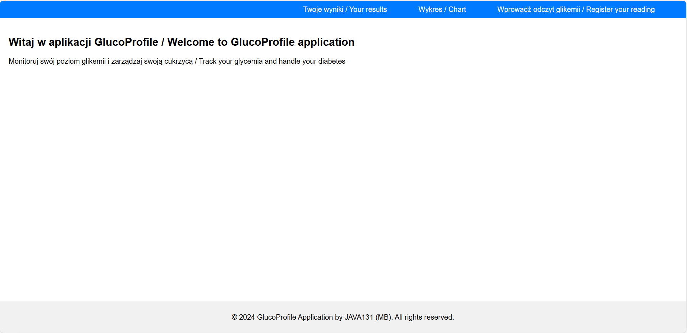
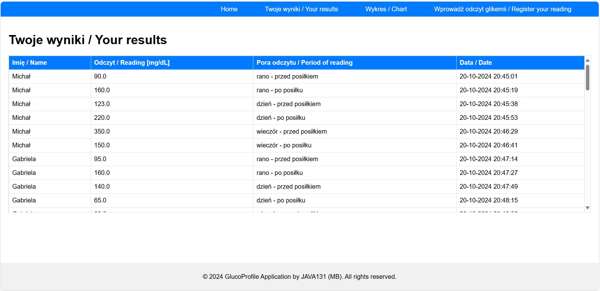
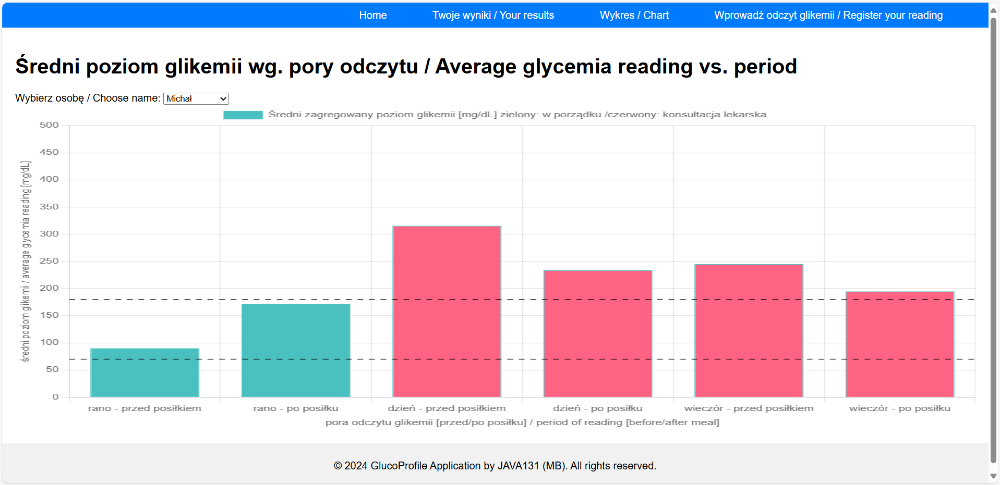
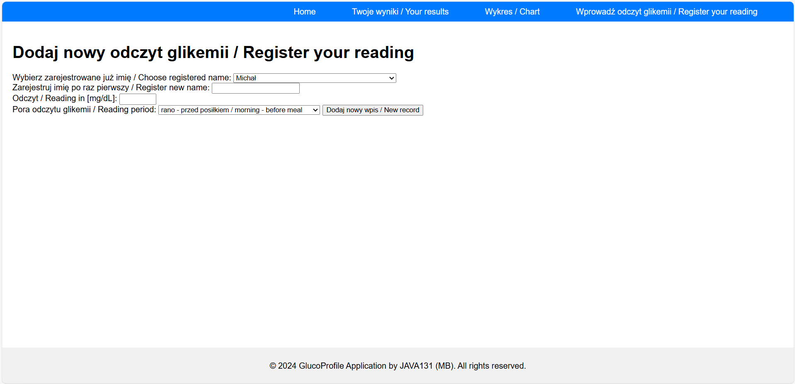

## JWD 2024 Final Project Description by Michał Bryniak (ID: JAVA131)

### EN: _General (initial) description of final project on PostGraduate Studies Java Web Developer 2023/2024 at WSZiB._

#### i. Final application is designed to support all diabetes person to manage glicemy level in order to keep it in accordance with TIR indicator requirements. 

#### ii. User would be able to insert own name and glycemia readings from manual (classic) gluco blood meter before and after meals.

#### iii. Family Member (set by User) would be able to track all readings, especially whenever glicemy level trend is dropping quicky (hypoglycemia) or rising quickly (hyperglycaemia).

#### iv. All datas will be presented by graphis charts. 

***

### PL: _Ogólny (wstępny) opis projektu zaliczeniowego na studiach podyplomowych Java Web Developer 2023/2024 w WSZiB._

#### i. Ostateczna aplikacja jest zaprojektowana do wspierania osób chorych na cukrzycę w zarządzaniu poziomem glikemii w zakresie zgodnym w wymaganianmi wskaźnika TIR. 

#### ii. Użytkownik będzie mógł wprowadzić swoje imię oraz odczyt poziomu glikemii z klasycznych glukometrów przed/po posiłkach.

#### iii. Członek Rodziny (założony przez Użytkownika) będzie mógł śledzić wszystkie odczyty glikemii, szczególnie kiedy jej poziom spada gwałtownie (hiperglikemia) lub rośnie (hyperglikemia).

#### iv. Wszystkie wyniki będa prezentowane za pomocą graficznych wykresów. 

***

Aplikacja jest dostępna pod adresem . Jest to czasowo dostępny serwis webowy.

Aplikacja składa się z czterech ston:

1. Home. Ekran powitalny informujący o funkcjonalności aplikacji.

2. Twoje wyniki. Jest to ekran wyświetlający zarestrowane wyniki glikemii użytkowników.

3. Wykres. Strona prezentuje średnie zagregowane wyniki glikemii dla poszczególnych użytkowników w 6ciu grupach pomiarowych.

4. Wprowadż odczyt glikemii. Interaktywna stona pozwalacją użytkownikowi aplikacji wprowadzić odczyt glikemii. Jak również zarejestować nowych użytkowików.
